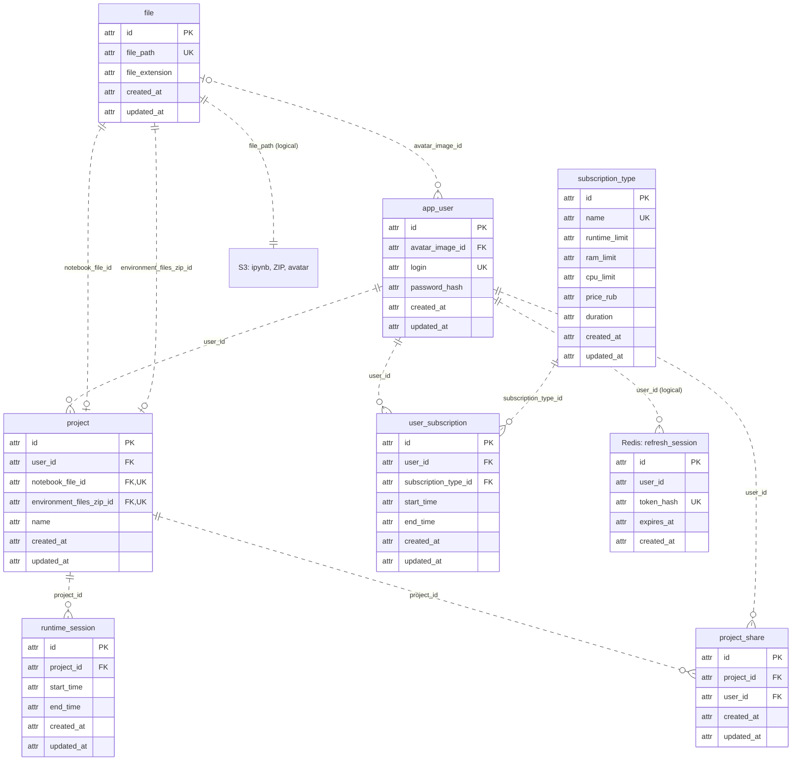

# ER-диаграмма ДЗ №1

Семь SQL-таблиц находятся в PostgreSQL. Refresh-сессии — в Redis,
содержимое ipynb, ZIP и аватаров — в S3. Диаграмма редактируется непосредственно
в этом Markdown-файле и использует стандартный блок Mermaid `erDiagram`.

`PK` — первичный ключ, `FK` — внешний ключ, `UK` — уникальный атрибут.
Составные и частичные ключи описаны в [relations.md](relations.md).
`||` — ровно один, `o|` / `|o` — ноль или один, `o{` — ноль или много.
Пунктир обозначает неидентифицирующие связи: FK не входит в PK дочерней таблицы.
Связи с Redis/S3 логические, не SQL FOREIGN KEY; они подписаны отдельно.

SQL-типы не указываются. Для обязательной пары `type name` в синтаксисе Mermaid
используется технический маркер `attr`, не обозначающий тип данных БД.

Обязательная ссылка проекта на ZIP допускает пустой архив. Один пользователь
может иметь много проектов, подписок, полученных доступов и refresh-сессий.
Для проекта хранится много запусков; одновременно незавершённым может быть один.
Подписки пользователя не пересекаются по времени.

Комментарии находятся в metadata блоков ipynb, код/текст — в cells, результаты —
в outputs. Эти вложенные структуры файла не являются таблицами PostgreSQL.
Их поля, ключи и права описаны в [relations.md](relations.md#s3-ipynb-zip-и-аватары).
Redis Pub/Sub передаёт временные уведомления о комментариях по WebSocket;
не создаёт отдельную таблицу или постоянную копию комментариев.
